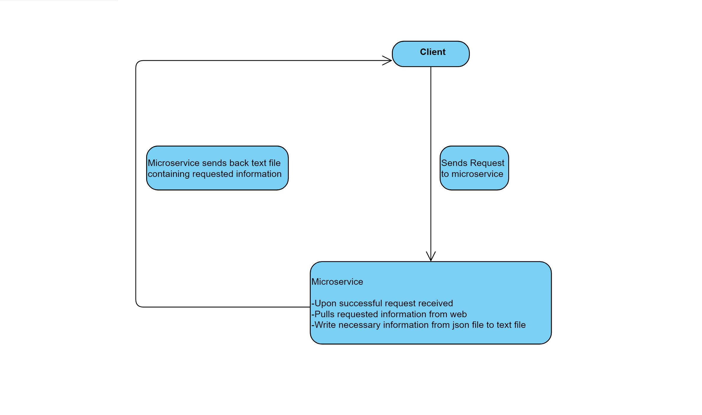

# CS361

COMMUNICATION CONTRACT:

How is your partner going to access your microservice? Should they get your code from GitHub? Should they run your code locally? Is your microservice hosted somewhere? Etc.

--My partner can get my code from my Github and they can run it locally.

Have you confirmed that you can successfully call YOUR PARTNER’S microservice? If not, do so. By when will you do that?

--Yes, I can successfully call my partner’s microservice.

If your partner cannot access/call YOUR microservice, what should they do? Can you be available to help them? What’s your availability?

--If partner cannot access/call my microservice, they should contact me and I will be available to help them. I’ll be available everyday.

If your partner cannot access/call your microservice, by when do they need to tell you?

--If partner should tell me as soon as possible if they cannot access/call my microservice.

Is there anything else your partner needs to know? Anything you’re worried about? Any assumptions you’re making? Any other mitigations / backup plans you want to mention or want to discuss with your partner?

--There is nothing else my partner needs to know about. We both have made sure the calls or access to our microservices are working perfectly.

Instructions on how to REQUEST data from the microservice:

--The programmer connects to the server. Then out of two ways to select planets, random or specific, the programmer sends the planet variable to the server.

Instructions on how to RECEIVE data from the microservice:

--The receiving server takes the query of random or specific planets then draws the information from a cvs file then loads it.

